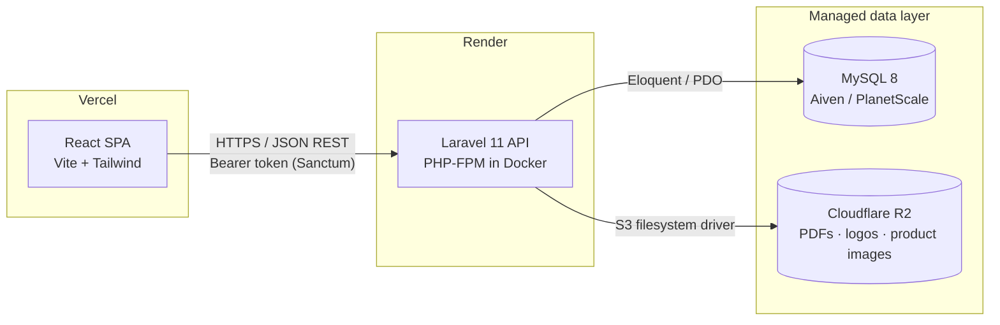
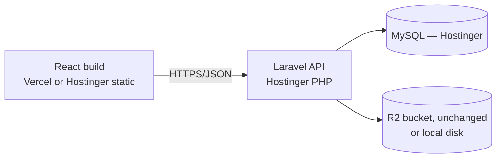
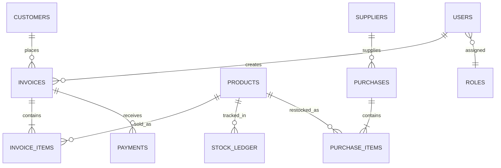

# Janatha Motors — Invoice & Inventory Management System
### Development Plan & Feasibility Review
Prepared: 2026-07-26 · Stack: React · Laravel · MySQL · Vercel · Render · Hostinger

---

## 1. Feasibility Verdict

**Yes — fully buildable with React + Laravel + MySQL**, deployed first on Vercel/Render and later migrated to Hostinger. Nothing in the request is a technical blocker, but five points need to be designed in from day one rather than patched later:

| # | Issue | Why it matters | Recommendation |
|---|-------|-----------------|-----------------|
| 1 | **Render has no managed MySQL** — its managed database offering is PostgreSQL only. | Running MySQL yourself in a Render Docker service has no backups/HA and isn't safe for real invoice data. | Use an external **managed MySQL** during the Render phase — Aiven or PlanetScale both have usable free/low-cost tiers. Don't use Postgres "temporarily" — Laravel migrations hide most dialect differences but not all (ENUM handling, fulltext index syntax, JSON functions), and you'd be doing a real migration, not a copy, when you reach Hostinger. |
| 2 | **Vercel cannot run PHP/Laravel.** | Vercel is for the React SPA only. | Keep the split explicit: **Vercel = frontend only**, **Render (later Hostinger) = Laravel API only**. |
| 3 | **Render's filesystem is ephemeral** on redeploy/restart (non-persistent-disk plans). | Generated invoice PDFs, product images, and the company logo would silently disappear. | Store all uploads/generated files in an **S3-compatible bucket** (Cloudflare R2 has a generous free tier) via Laravel's `s3` filesystem driver — never `storage/app/public` on Render. |
| 4 | **Cross-origin auth**: React (on `*.vercel.app`) and Laravel (on `*.onrender.com`) are different origins. | Sanctum's cookie/SPA-session mode is fragile across separate domains. | Use **Sanctum in token (Bearer) mode**, not cookie mode. This also carries over to Hostinger with zero auth code changes later. |
| 5 | **Render free tier sleeps after ~15 min idle** (10–30s cold start on next request). | Fine for staging; not acceptable while cashiers are actively invoicing customers. | Budget for Render's paid "Starter" tier once real invoices are being created, or move the API to Hostinger sooner than planned. |

Everything below is designed around these five points so there's no rework at the Hostinger cutover.

---

## 2. Architecture

**Later — Hostinger cutover:**

Only the boxes move — the API code, auth mode, and file-storage driver stay identical, which is the point of designing it this way now.

---

## 3. Tech Stack

| Layer | Choice | Why |
|---|---|---|
| Frontend framework | React 18 + Vite | Fast dev loop; Vercel's native zero-config deploy target |
| Styling / theming | Tailwind CSS with CSS variable tokens | First-class `dark:` support, trivial light/dark token swap |
| UI components | shadcn/ui (Radix primitives) | Accessible, unstyled enough to reskin to the JMS brand, no CSS-in-JS runtime cost |
| Server-state / client-state | TanStack Query + Zustand | Server cache (products, invoices) kept separate from small UI state (theme, auth) |
| Charts | Recharts | Enough for revenue/stock trend charts, small bundle |
| Backend framework | Laravel 11 (PHP 8.3) | Mature ORM, migrations, queues, first-party auth scaffolding |
| Auth | Laravel Sanctum — **token mode** | Stateless bearer tokens work cleanly across separate Vercel/Render domains |
| Roles & permissions | `spatie/laravel-permission` | Battle-tested roles+permissions tables; avoids hand-rolled ACL |
| PDF invoices | `barryvdh/laravel-dompdf` | Server-side invoice PDF generation, download & print |
| Database | MySQL 8.0 | Per requirement; managed externally pre-Hostinger, native on Hostinger after |
| File storage | Cloudflare R2 (S3-compatible) | Survives Render redeploys; same driver works unchanged after moving to Hostinger |
| Backend host (now) | Render (Docker web service) | Git-push deploy, free TLS, simple env var management |
| Backend host (later) | Hostinger Business/VPS | Native PHP + MySQL, SSH or Git deploy |
| Frontend host | Vercel | Native Vite/React support, preview deploy per PR |
| CI | GitHub Actions | Run PHPUnit + ESLint/Vitest on PR, trigger deploys |

---

## 4. Data Model (core tables)

- **users** — id, name, email, password, is_active *(roles/permissions via Spatie's pivot tables)*
- **customers** — id, name, phone, email, address, vehicle_no, opening_balance, current_due
- **suppliers** — id, name, phone, address
- **categories** / **brands** — simple lookup tables, categories self-referencing for sub-categories
- **products** — id, sku, name, category_id, brand_id, compatible_models, cost_price, selling_price, unit, reorder_level, is_active
- **stock_ledger** — id, product_id, type (purchase/sale/adjustment/return), quantity, reference_type, reference_id, created_by, created_at *(single source of truth for stock — never mutate `products.quantity` directly)*
- **purchases** / **purchase_items** — supplier restocking records
- **invoices** — id, invoice_no, customer_id, subtotal, discount, tax, total, paid_amount, due_amount, status (paid/partial/due/cancelled), created_by
- **invoice_items** — id, invoice_id, product_id, quantity, unit_price, discount, line_total
- **payments** — id, invoice_id, amount, method, paid_at, received_by
- **audit_logs** — id, user_id, action, model_type, model_id, changes (json), created_at — who edited a price or adjusted stock, and when
- **settings** — key/value: company info, tax rate, invoice prefix, default theme

---

## 5. Roles & Permissions

| Permission | Admin | Manager | Cashier | Inventory Clerk |
|---|:---:|:---:|:---:|:---:|
| Manage users | ✓ | – | – | – |
| Manage roles/permissions | ✓ | – | – | – |
| Manage system settings | ✓ | – | – | – |
| View dashboard & reports | ✓ | ✓ | limited | limited |
| Manage products / categories | ✓ | ✓ | – | ✓ |
| Adjust stock manually | ✓ | ✓ | – | ✓ |
| Manage suppliers & purchases | ✓ | ✓ | – | ✓ |
| Create invoice | ✓ | ✓ | ✓ | – |
| Void / refund invoice | ✓ | ✓ | – | – |
| Apply discount above staff limit | ✓ | ✓ | – | – |
| Manage customers | ✓ | ✓ | ✓ | – |

Implemented with `spatie/laravel-permission` so roles and their permission sets live in a seeder — reproducible identically across local, Render, and Hostinger.

---

## 6. Feature Modules

1. **Auth & Access** — login, forgot password, role-based route/menu guarding, per-user activity log
2. **Inventory** — categories/brands, product CRUD with SKU & compatible-vehicle tagging, stock-in via purchases, automatic stock-out on invoicing, manual adjustments, low-stock alerts
3. **Customer Management** — profiles, purchase history, running due/credit balance, quick-add during invoicing
4. **Invoicing** — line-item builder with live stock check, item- and invoice-level discounts, tax, partial payments & due tracking, PDF generation/printing, void/return flow with automatic stock reversal
5. **Dashboard** — today/week/month sales, top-selling parts, low-stock list, outstanding dues, revenue trend chart
6. **Reports** — sales by date range/customer/product, stock valuation, profit margin, CSV/PDF export
7. **Settings** — company profile & logo, invoice numbering/prefix, tax rate, user & role management
8. **Theming** — Tailwind CSS-variable tokens, toggle stored in `localStorage` + user profile, respects OS `prefers-color-scheme` by default

---

## 7. Deployment Plan

**Phase A — Local development**
Laravel via Docker Compose (or Sail) + MySQL 8 container; React via Vite dev server; `.env` per environment.

**Phase B — Staging / launch (Vercel + Render)**
- *Frontend:* connect the GitHub repo to Vercel, set `VITE_API_URL` to the Render API URL, enable preview deployments per PR.
- *Backend:* Dockerfile (`php:8.3-fpm` + nginx), push to Render, set env vars (`DB_*`, `APP_KEY`, `FILESYSTEM_DISK=s3`, R2 credentials, Sanctum in token mode).
- *Database:* provision managed MySQL (Aiven or PlanetScale), run `php artisan migrate --seed`.
- *Storage:* create the R2 bucket, configure CORS for PDF/image access.
- *Domain/TLS:* Vercel and Render auto-provision TLS; once a domain is bought, point `app.janathamotors.lk` and `api.janathamotors.lk` at them.

**Phase C — Hostinger cutover (later)**
- Confirm the Hostinger plan supports SSH + Composer (Business/Cloud or VPS tier).
- `mysqldump` from the managed MySQL instance → import into Hostinger's MySQL.
- Deploy Laravel via Git/SSH; keep `FILESYSTEM_DISK=s3` pointed at the same R2 bucket (or move to local disk if preferred).
- Repoint DNS for `api.janathamotors.lk` to Hostinger; keep the frontend on Vercel or move it to Hostinger's static hosting too.
- Verify, then decommission the Render service.

---

## 8. Roadmap

| Week | Focus |
|---|---|
| 1 | Repo scaffolding, CI, auth + RBAC, base layout & theme toggle |
| 2 | Inventory module — products, categories, stock ledger |
| 3 | Customer management + suppliers/purchases |
| 4 | Invoicing engine — create/edit, stock deduction, PDF generation |
| 5 | Payments, dues tracking, returns/void flow |
| 6 | Dashboard + reports |
| 7 | Polish, permission edge cases, automated tests, deploy to Vercel/Render staging |
| 8 | UAT with shop staff, bug fixes, go-live, Hostinger migration prep |

~8 weeks part-time-friendly; compressible to 4–5 weeks full-time for one developer.

---

## 9. Risks & Recommendations

- Lock in the MySQL host **before** writing the first migration — don't detour through Postgres.
- Use Sanctum token mode from day one; don't start with cookie sessions and switch later.
- Wire up S3-compatible storage from day one, not "add later" — Render's ephemeral disk will otherwise silently eat uploaded files during development.
- Seed roles/permissions via a Laravel seeder so they're reproducible across every environment, including Hostinger.
- Make invoice numbering atomic (DB transaction + row lock) to prevent duplicate numbers when two cashiers invoice at the same time.
- Add the `audit_logs` table early — a spare-parts shop needs to know who edited a price or adjusted stock.
- Buy the real domain before go-live so the Vercel → Render → Hostinger DNS moves are a non-event.
